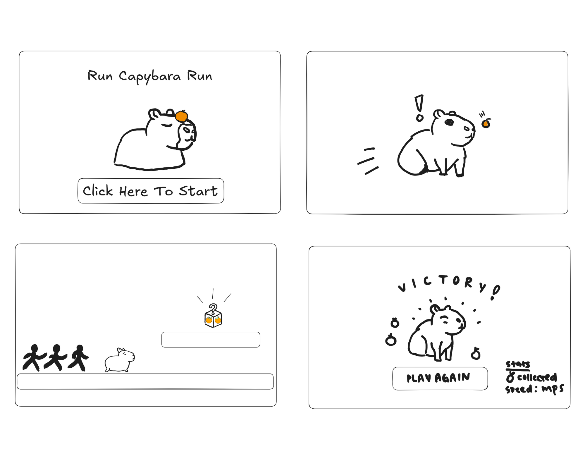

## Table of Contents

- [Overview](#overview)
- [User Guide](#user-guide)
- [Design & Illustrations](#design-and-illustrations)
- [Further Development](#further-development)
- [Team](#team)
- [Citation](#citation)
- [Community Feedback](#community-feedback)

## Overview

**Run Capybara Run** is a fast-paced side-scrolling platformer where you guide a clever capybara through dynamic levels filled with obstacles and surprises. With fun visuals and smooth controls, the game offers an exciting experience for casual and competitive players alike.

### Objective

You play as a capybara trying to escape from pursuing villains. Run and jump across platforms, avoid traps, and collect mystery boxes that grant temporary hacks, hints, or power-ups. Reach the finish line without getting caught to win the game!

## User Guide

This video provides a walkthrough of Run Capybara Run.
_Insert video here_

## Design & Illustrations

The visual style of Run Capybara Run is lighthearted and playful, matching the tone of the game. The character design, environment, and UI were all created with consistency and simplicity in mind to support fast-paced gameplay without distractions.

- Character Design: The capybara was illustrated to be cute, expressive, and easily distinguishable from background elements. Animations include running, jumping, and reacting to obstacles.

- Environment: Platforms, backgrounds, and obstacles use a bright color palette and cartoon-like style. Scenery elements such as trees and bushes create depth.

- Capy Snacks: One of capybara's favorite fruit, oranges, are intuitive and stand out visually, so players can quickly recognize and pick them up during the run.

- Storyboard Influence: Our early storyboard helped define the game's visual flow and progression. Each scene was mapped to match the capybara's journey, giving the development team a reference for level pacing, enemy placement, and player feedback cues.

## Further Development

## Team

Run Capybara Run is designed and implemented by Doewon Studios

(Sam Doan, Adam Winfield-Smith, and Rina Ogino).

- [Sam Doan](https://github.com/samdoann)
- [Adam Winfield-Smith](https://github.com/adamwins)
- [Rina Ogino](https://github.com/rinaogino)

## Citation

- [GitHub Organization](https://github.com/Doewon-Studios)
- [Godot](https://godotengine.org/)
- [Godot Tutorial](https://www.youtube.com/watch?v=LOhfqjmasi0)

## Community Feedback

We are interested in your experience using Run Capybara Run! Please let us know with what you think about our game, and how we can better it.
