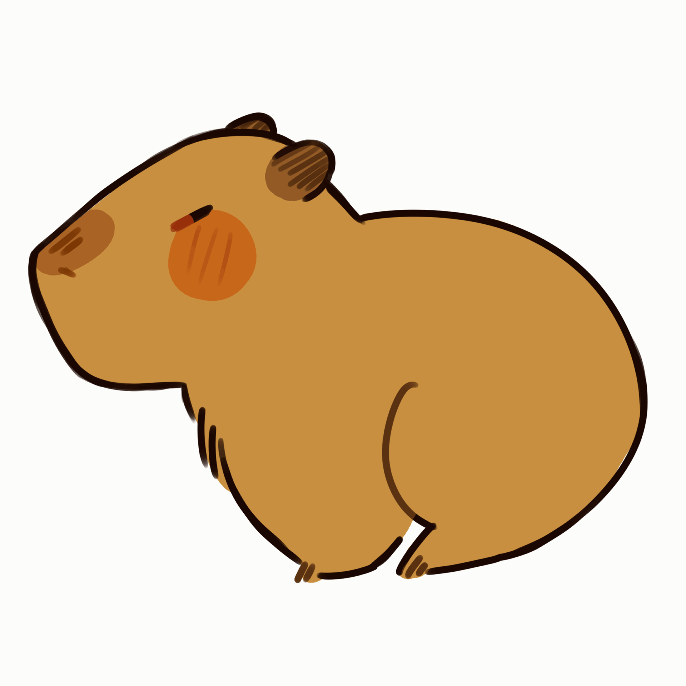
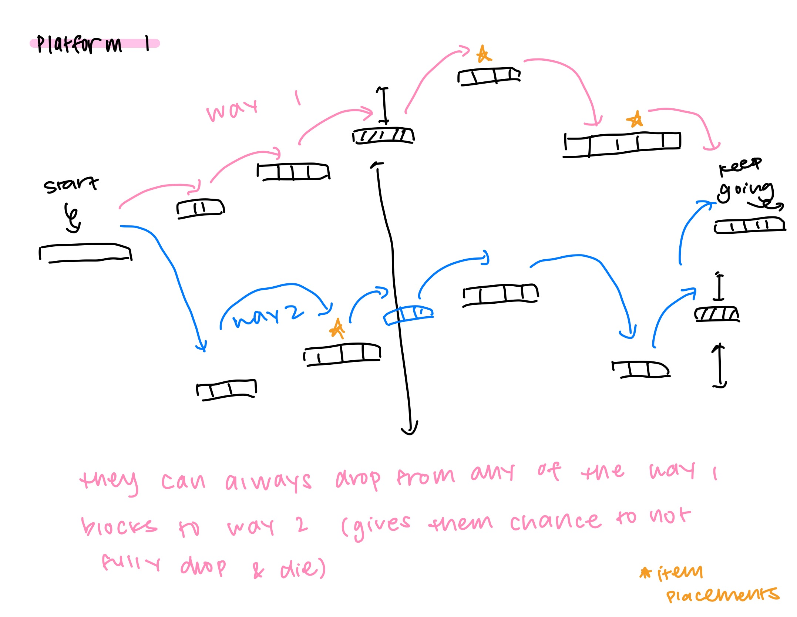
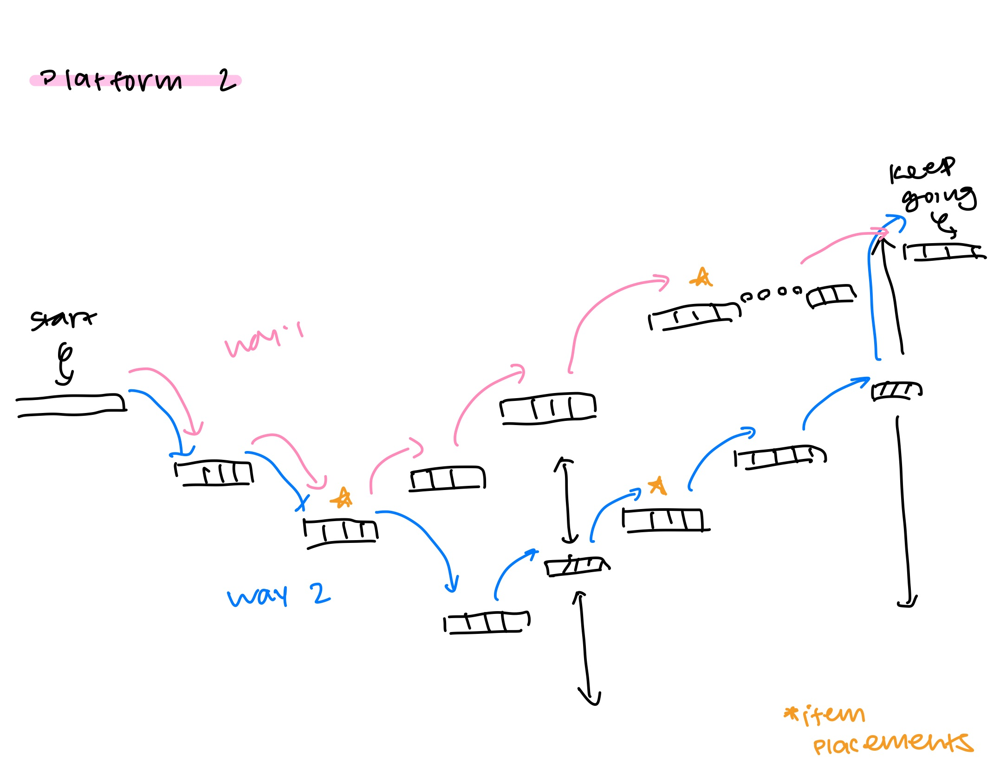

## Table of Contents

- [Overview](#overview)
- [Game Play](#game-play)
- [Design & Illustrations](#design-and-illustrations)
- [Further Development](#further-development)
- [Team](#team)
- [Citation](#citation)
- [Community Feedback](#community-feedback)

## Overview

**Run Capybara Run** is a fast-paced side-scrolling platformer where you guide a clever capybara through dynamic levels filled with obstacles, surprises, and collectible goodies. With charming visuals and smooth controls, the game offers an exciting experience for players.

Objective: Take control of a speedy capybara as you dash and leap across platforms, dodge tricky traps, and collect capybara's favorite snack--yuzu! Test your skills in endless mode. How far can you make it? Give it a try!

## Game Play

This video provides a walkthrough of Run Capybara Run.

[Run Capybara Run Demonstration](https://drive.google.com/file/d/1klL32ACbaU57uGu8MrKmEr8FeZy_ivZ0/view?usp=sharing)

## Design & Illustrations

The visual style of Run Capybara Run is lighthearted and playful, matching the tone of the game. The character design, environment, and UI were all created with consistency and simplicity in mind to support fast-paced gameplay without distractions.

**Character Design**: The capybara was illustrated to be cute, expressive, and easily distinguishable from background elements. Animations include running, jumping, and reacting to objects.

**Environment**: Platforms, backgrounds, and obstacles use a bright color palette and cartoon-like style. Scenery elements such as trees and bushes create depth.

**Objects**: One of the capybara’s favorite fruits, yuzu, is designed to be visually distinctive and intuitive, allowing players to quickly recognize and collect it during the run.

**Storyboard Influence**: Our early storyboard helped define the game's visual flow and progression. Each scene was mapped to match the capybara's journey, giving the development team a reference for level pacing, enemy placement, and player feedback cues.

**Level Design**: To ensure smooth gameplay and increasing difficulty, we sketched out platform placements and obstacle locations before implementing them. These sketches served as blueprints for pacing jumps, timing enemy encounters, and positioning objects for optimal player engagement.

## Further Development

While Run Capybara Run is fully playable in its current form, there are several exciting features we plan to explore for future updates:

**Capybara Customization**: Players will be able to personalize their capybara with different hats, outfits, or accessories. This adds a fun layer of expression and player identity, especially for younger audiences or fans of collectibility.

**Unlockable Wallpapers/Themes**: To enhance visual variety, we plan to add unlockable backgrounds and in-game themes. These could be tied to player achievements, seasonal events, or special challenges.

**Monetization Potential**: Once a solid customization system is in place, we may experiment with a freemium model, keeping the core game free while offering premium items (e.g., exclusive skins or animated backgrounds) for a small fee. This would help support ongoing development while keeping the game accessible.

**Expanded Levels & Characters**: Future builds could include new characters, power-ups, and enemy types, giving players more ways to enjoy and master the game.

These additions aim to improve player retention, encourage replayability, and offer opportunities for community engagement.

## Team

Run Capybara Run was developed by Doewon Studios, a creative team consisting of Sam Doan, Adam Winfield-Smith, and Rina Ogino.

- [Sam Doan](https://github.com/samdoann)
- [Adam Winfield-Smith](https://github.com/adamwins)
- [Rina Ogino](https://github.com/rinaogino)

## Citation

- [GitHub Organization](https://github.com/Doewon-Studios)
- [Godot](https://godotengine.org/)
- [Godot Tutorial](https://www.youtube.com/watch?v=LOhfqjmasi0)

## Community Feedback

We are interested in your experience using Run Capybara Run! Please fill out the [Doewon Studios: Run Capybara Run Feedback form](https://forms.gle/4WWJWztNFmT46KWs7).
